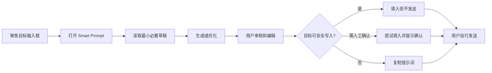

# Smart Prompt 产品契约

状态：阶段 0 已冻结  
生效日期：2026-07-17  
适用范围：浏览器扩展、桌面 Overlay、桌面控制中心、本地运行时

## 一句话定义

Smart Prompt 是输入框旁的上下文提示词编辑器：它把当前草稿整理成可审核的提示词，填回原输入框，但永不替用户发送。

## 唯一核心任务

用户只需要完成一条主流程：



浏览器和桌面必须共享这条流程。平台差异只允许存在于 Target Adapter，不允许产生第二套产品状态或用户文案。

## 不可妥协的承诺

1. 生成结果必须先进入用户审核，不得直接发送。
2. 写入前必须重新确认目标；窗口隐藏、最小化、非前台或目标不安全时不得写入。
3. `no-auto-submit` 必须始终为 `true`；发现自动提交信号时立即进入 `blocked`。
4. 无法机器回读时只能标记为“需要人工确认”，不得伪造机器验证成功。
5. 目标能力不足时降级为 copy-only，不得通过放宽 safe candidate 换取成功状态。
6. 普通用户界面不得显示 `payload_guard`、`visualOnly`、`safeCandidate`、evidence token 等内部术语。
7. 诊断和指标只保存必要元数据，不保存 Prompt 正文、目标输入正文或剪贴板正文。

## 产品形态

### 日常入口

- 浏览器：目标输入框旁的小人和 Assistant Card。
- 桌面：认证工具输入框旁的小人和同一 Assistant Card。
- 快捷键：仅作为无法可靠定位目标时的备用入口，打开同一 Assistant Card。

### 低频入口

桌面主窗口只承担设置、兼容性、隐私和诊断。它不是第二个 Prompt 编辑器，也不是研发报告首页。

### 技术分层

- Prompt Session：状态、命令、原因、文案和 View Model。
- Target Adapter：DOM、Windows UIA 与测试 Fake 的读取、写入、验证和撤销。
- Local Runtime：Provider、凭证、Skill、历史、指标和诊断。

## 当前范围锁定

### P0：核心闭环

- 统一 Prompt Session 和 Assistant View Model。
- 浏览器 DOM 目标识别与 verified insert。
- 桌面认证工具目标识别与严格写回守卫。
- 生成、重新生成、可编辑预览、填入、复制和撤销。
- Provider 配置、本地隐私、有限用户原因和恢复动作。
- `no-auto-submit` 与机器/人工验证区分。

### P1：闭环之后

- 共享 Assistant Card 实际 DOM/CSS。
- 首次启动向导、兼容性中心和运行时自动修复。
- 人工确认写回记录、历史与收藏、轻量反馈。
- 双端视觉回归与 Evidence freshness。

### P2：有数据后再决定

- Skill 推荐优化与高级模式覆盖。
- 更多已证明有需求的站点或桌面工具。
- 更细的质量归因和本地聚合分析。

## 扩功能冻结规则

在共享 Assistant Card 和 Windows 核心闭环通过前，不得新增：

- 网页站点、桌面工具或 macOS AX 适配。
- Provider 或多模型对比入口。
- 新分析面板、研发指标卡或 evidence chip。
- 新快捷回复、模式、语言切换控件或 Overlay 动画。
- 团队同步、Prompt Marketplace、远程运营和远程错误上报。

例外只允许修复安全、隐私、数据丢失、核心闭环回归或阶段 0/1 契约缺口。任何例外都必须写明用户问题、成功指标、回滚方式和验证证据。

## 阶段 0 基线

### 命令基线

2026-07-17 已通过：

```text
node prototypes/browser-extension/tests/prompt-engine.test.js
node prototypes/browser-extension/tests/manifest.test.js
node prototypes/browser-extension/tests/site-adapters.test.js
npm.cmd test --prefix apps/desktop-shell
```

浏览器 `runtime-demo.test.js` 的默认清理会永久删除临时目录，本轮未把该默认路径作为安全基线。GUI 验证应使用保留临时产物的模式。

### 截图基线

- `outputs/product-reassessment-2026-07-17/01-desktop-main.png`
- `outputs/product-reassessment-2026-07-17/02-browser-extension-open.png`

这些截图只用于记录阶段 0 之前的体验分叉，不代表阶段 1 视觉统一已经完成。

## 变更验收

阶段 0/1 的每次改动至少回答：

1. 是否仍走唯一核心流程。
2. 是否只通过 Prompt Session 输出用户状态和核心文案。
3. 是否保持 Target Adapter 的原有安全边界。
4. 是否保持 `no-auto-submit`。
5. 是否有契约测试和端侧装配测试。
6. 是否诚实区分命令通过、GUI 通过和真实写回通过。

## 版本化扩展：Codex Outcome Learning Loop v1

生效日期：2026-07-19  
事实源：`workflows/codex-outcome-learning-loop-v1.md`  
共享契约：`packages/outcome-learning/index.js`，bundle 版本 `outcome-learning@1`

本节是阶段 0 产品契约的增量版本，不替换上文的唯一核心流程，也不修改 `prompt-session@1` 已有的生成、审核、copy-only、人工确认、机器验证和撤销语义。

### 范围与兼容性

- P0 唯一真实目标收敛为 Codex 桌面端；ChatGPT 只保留回归验证，Trae、WorkBuddy 和更多目标不属于本版本。
- `prompt-session@1` 继续作为 Assistant Card 的 View Model 与交互状态机；`prompt-session@2` 仅是 Outcome Learning bundle 中的版本化结果事件信封，不是第二套 UI 状态机。
- `phase3-activation@1` 作为 legacy 记录只读保留；新激活使用 `codex-activation@2`。旧版已激活与 Codex 尚未验证可以同时成立，迁移不得覆盖 Provider、Custom Provider、模型、加密凭证或旧证据。
- Node local service 与 Rust native sidecar 必须消费同一 fixture 集并保持生产语义一致；安装包使用 native sidecar，Node-only 通过不构成完成。

### 日常闭环

1. 只有 Codex 输入框处于可确认的前台、焦点和安全状态时显示小人；快捷键只能进入 copy-only Card。
2. 打开 Card 只读取 Codex 当前草稿，不读取聊天历史、屏幕、项目文件、剪贴板或附件，也不自动调用模型。
3. 用户触发生成后，结果先进入可编辑审核；Fill 完整替换当前草稿，写入前重新验证窗口、焦点、目标、草稿和 payload freshness。
4. 只有机器回读与目标文本完全一致才产生 `verified_insert`；永不触发 Enter、发送按钮或提交快捷键。
5. verified insert 后显示“已填入，未发送”，自动收回为小人；仅在目标、内容、窗口和 Session 未变化时允许精确撤销。

### Outcome、学习与策略

- 每次 verified insert 创建脱敏 Pending Outcome。至少 60 秒后，同一 target 与同一 project scope 再次打开时至多询问一次结果；未回答保持 `unknown`，24 小时后变为 `expired_unknown`，不计成功或失败。
- Learning Observation 只持久化枚举、桶、计数、项目作用域 token、版本和 keyed HMAC 特征。Prompt 正文、草稿、聊天正文、剪贴板正文、窗口标题、绝对路径、凭证和原始 evidence 不得进入长期存储或公共 API。
- Memory、Rule、Skill 与 Generation Policy 候选可以按门槛自动创建，但默认不生效。Memory/Rule/Skill、权限扩张与全局作用域必须经用户最终确认；Skill 脚本还必须通过权限、隔离测试和对抗审查。
- 四类候选必须来自 verified outcome 生产链路。`learning-candidate-seed@1` 只把 Session 内输入映射为固定、可验证、无原文的 Memory/Rule/Skill seed；未命中语义 seed 时使用 Generation Policy。调用方不能提交 seed 或候选 evidence。
- 调用方省略任务场景时，Node 与 native Rust 按 `task-scenario-inference-fixtures@1` 的同一有序规则进行瞬时推断；显式场景优先，长期数据只保存有限场景 token。
- Assistant Card 打开时允许通过本地 `/learning/v1/reminder/resolve` 做零模型调用的候选匹配；原始草稿只用于本次请求，不持久化、不回显，界面只显示一行普通用户提醒。
- 低风险 Generation Policy 可在项目内按 10% canary 自动试用。质量与安全是硬门槛；每臂至少 10 个可归因结果、置信要求满足且 Token、耗时或返工至少一项改善后才可晋升。自动发送、误写、隐私、权限或安全异常立即回滚。
- Token 只作为结果质量之外的效率维度，来源必须标记为 `provider`、`estimated` 或 `unavailable`；不可用样本不进入分母，Token 改善不能单独驱动晋升。
- Policy 归因、rollout 隐式信号和 benchmark 结果必须来自服务端验证事务或已授权 harness。公开 outcome/feedback 请求不得自报这些证据；请求体中的 Token、耗时、Retry、Undo、编辑特征和候选内容不得进入学习观测。
- 公开 outcome API 不能创建 `verified_insert`，公开晋升 API 不能提交全局晋升证据；两者都必须由服务端从已验证事务和已持久化结果中派生。
- 生成 Prompt 与最终写入文本只在 Session 内存中比较，长期仅保存编辑特征摘要。实质编辑计入返工；只有 verified insert、Session、项目和 Policy 绑定一致且被服务端标记为 rollout eligible 的 Observation 才进入灰度统计。
- 数据备份恢复必须移除 verified insert、编辑摘要等服务端信任标记；清除项目数据必须同时归档并使生成历史绑定失效，防止恢复或清除后的旧证据继续参与学习。

### 扩展上下文边界

`context-source@1` 只定义未来聊天历史、当前屏幕、项目文件、剪贴板和附件的来源、信任、权限、预览、预算与收集结果。所有来源默认关闭、独立授权、调用模型前可预览和移除，并按不可信数据处理。当前版本不实现真实读取器；`promptInjectionRisk` 非 `low` 时不得标记为 `collected`。

### 契约版本表

| contract | version |
| --- | --- |
| Prompt Session 结果事件 | `prompt-session@2` |
| Codex Target Adapter 结果 | `codex-target-adapter-result@1` |
| Pending Outcome | `pending-outcome@1` |
| Learning Observation | `learning-observation@1` |
| Learning Artifact | `learning-artifact@1` |
| Learning Candidate Seed（内部） | `learning-candidate-seed@1` |
| Generation Policy | `generation-policy@1` |
| Policy Rollout | `policy-rollout@1` |
| Benchmark Result | `benchmark-result@1` |
| Runtime Evidence | `runtime-evidence@1` |
| Context Source | `context-source@1` |

### 验收分层

- 命令验证、静态视觉、安装包 smoke、真实 Codex 写回和真实 benchmark 必须分别记录，不能互相替代。
- 普通测试只使用临时数据目录、假凭证和 fake executor，不消耗真实模型额度。
- 安装、前台切换、真实 Codex GUI 读写、剪贴板操作和真实 benchmark 都需要用户对当轮明确授权；真实 benchmark 还必须先确认预算。
