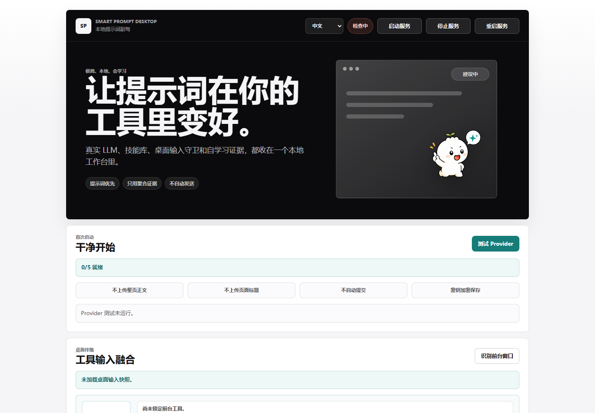
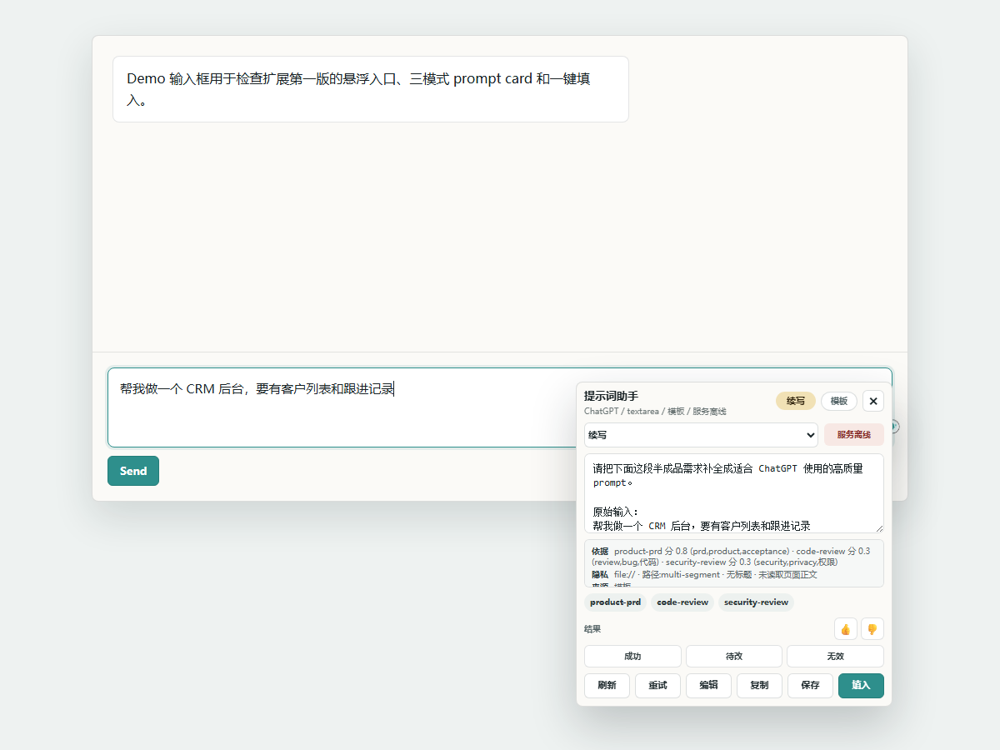
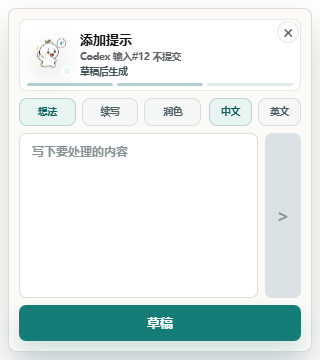
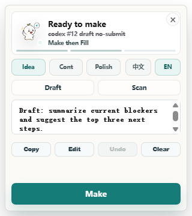
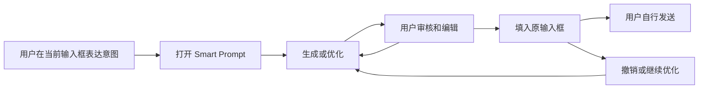
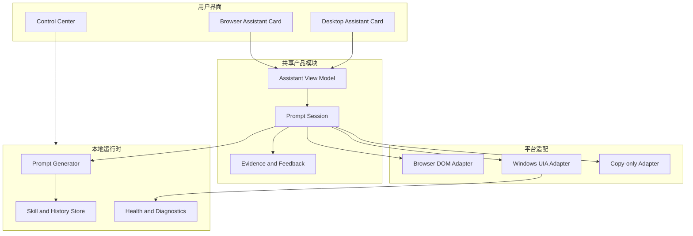

# Smart Prompt 第一性原理产品重构方案

- 日期：2026-07-17
- 状态：产品方向建议稿，可直接转为实施任务
- 范围：浏览器扩展、桌面悬浮助手、桌面控制中心、本地服务、共享核心、验证体系
- 结论级别：基于当前代码、文档、当前静态界面截图和现有运行证据的产品与架构复盘

## 0. 执行摘要

Smart Prompt 当前最大的问题不是缺少功能，而是缺少统一产品形态。

仓库实际上同时长出了四套东西：

1. 浏览器里的 Prompt Card。
2. 桌面输入框旁的悬浮小人和 Overlay。
3. 启动桌面应用后出现的本地工作台。
4. 面向研发验收的指标、实验、诊断和真实写回验证平台。

它们分别解决了局部问题，但没有共享同一个用户任务、状态模型、信息层级和操作语言，因此用户会产生三个直接困惑：

- 网页端与桌面端看起来不是同一个产品。
- 桌面应用启动后不知道应该做什么。
- 页面展示了大量工程能力，但没有帮助用户更快完成一次提示词优化。

本方案的核心决策是：

> Smart Prompt 应成为一个“输入框旁的上下文提示词编辑器”。它只有一个核心任务、两个用户界面、三个技术层。

一个核心任务：

> 把用户当前输入框里的模糊意图，变成更清晰、可审核、可填入且绝不自动发送的提示词。

两个用户界面：

1. **上下文助手**：网页端与桌面端共用同一套交互、状态和视觉结构。
2. **控制中心**：只处理首次配置、模型、资料来源、隐私和诊断，不承担日常提示词编辑。

三个技术层：

1. **Prompt Session**：统一生成、编辑、审核、填入、撤销和状态转换。
2. **Target Adapter**：分别适配浏览器 DOM 与 Windows UIA，但对上提供相同接口。
3. **Local Runtime**：Provider、凭证、Skill、历史、指标和诊断，默认隐藏运行。

### 最重要的产品取舍

- 保留：输入识别、生成、编辑、填入、撤销、no-auto-submit、隐私、Provider、本地 Skill、适配器和诊断。
- 下沉：Provider 细节、Skill 管理、Prompt 历史、兼容性状态、诊断导出。
- 移出普通用户界面：Service 启停、桌面 Self-Test、Learning Loop、Pilot Outcomes、Quality Lift、实验分群和原始 evidence token。
- 暂缓：macOS、团队同步、Skill embedding、远程监控、多模型对比、Remotion 动画深化、更多站点扩张。
- 新增：统一状态机、统一文案、统一助手 UI、首次启动向导、兼容性中心、明确的错误恢复、运行时自动修复、人工确认型桌面写回验收。

### 推荐实施顺序

1. 先冻结新增功能，确定统一体验契约。
2. 抽出共享 Prompt Session 模块。
3. 让网页和桌面共用同一个 Assistant Card。
4. 把桌面主窗口改造成低频控制中心，并默认托盘启动。
5. 再处理 WorkBuddy 等真实桌面写回兼容性。
6. 最后恢复反馈学习、历史和更广泛适配。

若由一名熟悉当前代码的工程师连续实施，建议按 4 至 6 周安排，不建议继续在现有三个界面上分别补功能。

---

## 1. 本次审计范围与证据

### 1.1 当前界面证据

本轮重新生成并检查了以下静态界面：

- 桌面主窗口：`outputs/product-reassessment-2026-07-17/01-desktop-main.png`
- 浏览器扩展展开态：`outputs/product-reassessment-2026-07-17/02-browser-extension-open.png`
- 桌面 Overlay 中文空白态：`research/p25-overlay-chat-waiting-zh.png`
- 桌面 Overlay 草稿态：`research/p25-overlay-chat-draft-ready.png`









说明：浏览器截图来自本地 Demo，不代表真实登录站点兼容性；桌面 Overlay 截图来自项目视觉验证资产，不代表最新真实前台写回已经完成。

### 1.2 当前代码事实

桌面主窗口当前包含：

- 12 个主区块
- 20 个按钮
- 16 个输入、文本域或下拉控件
- 23 个一级至三级标题

主要区块集中在 `apps/desktop-shell/index.html`：

| 区块 | 当前行 | 当前性质 |
| --- | ---: | --- |
| 营销式 Hero | 11 | 品牌展示，不是日常任务 |
| First Run | 60 | 首次配置 |
| Desktop Companion | 78 | 日常任务和研发自测混合 |
| Learning Loop | 128 | 研发分析 |
| Pilot Outcomes | 149 | 研发分析 |
| Quality Lift | 171 | 研发分析 |
| Quality Segments | 197 | 研发分析 |
| Outcome Follow-up | 222 | 反馈运营 |
| Diagnostics | 234 | 支持与排障 |
| Provider Settings | 246 | 配置 |
| Skill Library | 293 | 资料管理 |
| Prompt Library | 306 | 资料管理 |
| Shortcut | 323 | 配置 |

关键实现规模：

| 文件 | 行数 | 判断 |
| --- | ---: | --- |
| `apps/desktop-shell/src/app.js` | 2831 | 多个产品模块和运行协调混在一起 |
| `apps/desktop-shell/src/overlay.js` | 1187 | 状态、文案、DOM、IPC 和交互混在一起 |
| `apps/local-service/src/server.js` | 1105 | 路由已改善，但仍承担过多产品编排 |
| `apps/local-service/src/store.js` | 1015 | 设置、库、历史、指标、反馈、诊断混在一起 |
| `prototypes/browser-extension/src/content.js` | 1151 | UI、生成、反馈、写回和站点交互混在一起 |
| `packages/shared/smart-prompt-core.js` | 756 | 共享算法和站点数据仍偏重 |

### 1.3 当前运行证据边界

以下报告不是当前实时状态，且部分语义存在历史兼容问题：

| 报告 | 时间 | 状态 | 解释 |
| --- | --- | --- | --- |
| `p25-runtime-readiness.latest.json` | 2026-06-17 | `pass=false` | 候选程序早于源码或构建输入 |
| `p25-overlay-click-chain.latest.json` | 2026-06-17 | `completionReady=false` | 缺当前运行时与真实点击闭环 |
| `m3-real-desktop-tools-workbuddy.latest.json` | 2026-06-18 | 顶层 `pass=true`，但 `writeVerified=false` | 旧报告顶层语义不可作为完成依据 |
| `m3-real-desktop-tools-trae.latest.json` | 2026-06-17 | 未进行写入 | 目标工具当时未在前台 |

因此，本方案把“视觉通过”“测试通过”“真实工具可用”视为三个不同层级，不再用一个 `pass` 混合表达。

---

## 2. 第一性原理：这个产品真正解决什么问题

### 2.1 用户原始问题

用户不是缺少另一个 Prompt 管理平台，也不是想学习 Provider、UIA、Skill routing 或指标体系。

用户的原始困难发生在准备向 AI 提问的那一刻：

- 脑中只有模糊意图，不知道如何组织。
- 已经写了一半，但缺少目标、约束或验收标准。
- 写完了，但担心表达不清、结构不完整或不适合当前工具。
- 已经有好用的 Skill 或规范，但在输入时想不起来。
- 想快速改好并放回输入框，又不希望工具替自己发送。

### 2.2 用户期望的最终结果

用户不是要“使用 Smart Prompt”，而是要：

> 在不离开当前工作上下文的前提下，更快得到一个自己看得懂、改得动、敢于提交的提示词。

衡量价值的核心不是功能数量，而是：

1. 是否比用户自己重写更快。
2. 结果是否明显比原输入更完整。
3. 是否能稳定回到正确输入框。
4. 用户是否始终保留最终发送权。
5. 失败时用户是否知道下一步该怎么做。

### 2.3 不可妥协的约束

- 不自动提交。
- 不默认读取整页或整屏。
- 不在目标不明确时猜测写入。
- 不要求用户理解服务、候选、证据或适配器。
- 不让配置和诊断阻塞日常生成。
- 浏览器和桌面必须共享同一交互语言。

### 2.4 核心用户循环



任何不能直接改善这个循环、保证这个循环或解释这个循环失败原因的功能，都不应该出现在主体验中。

---

## 3. 当前产品为什么会显得不一致

### 3.1 根因一：按技术里程碑堆界面，而不是按用户任务设计

PRD 的 M1、M2、M3、V5、V6 每阶段都产出了一套可见能力。桌面主窗口把这些阶段性成果逐步堆到了同一页面：

- M2 的 Provider、Skill、Prompt、快捷键。
- M3 的桌面输入识别和 Self-Test。
- V5/V6 的 Pilot、Quality、Feedback 和 Learning。
- P24/P25 的悬浮小人、证据和真实写回状态。

这些能力在工程上都有来源，但在用户层并不属于同一个频率和场景。

### 3.2 根因二：网页端和桌面端各自实现了产品逻辑

网页 Prompt Card 的主逻辑位于 `prototypes/browser-extension/src/content.js`，桌面 Overlay 的主逻辑位于 `apps/desktop-shell/src/overlay.js`。

两者分别决定：

- 状态名称
- 操作按钮
- 模式和语言展示
- 反馈控件
- 写回后的成功状态
- 错误提示
- 技能和证据显示

即使它们调用相同的生成核心，也会自然演化成两种产品。

### 3.3 根因三：研发证据被直接暴露给普通用户

桌面主窗口中的 Learning、Pilot、Quality、Segments、Self-Test 和服务控制，本质上是研发或支持工具。

桌面 Overlay 中的 evidence state、evidence action、evidence policy、guard token 和模拟对话，也主要服务于验证脚本。

它们提高了可验证性，却降低了可理解性。

### 3.4 根因四：桌面主窗口没有明确角色

当前桌面窗口同时想做：

- 产品介绍页
- 首次启动向导
- Prompt 工作台
- 服务管理器
- Provider 设置页
- Skill 和 Prompt 库
- 指标分析后台
- 诊断工具
- 桌面写回测试台

因此用户启动后看到了一个完整系统，但找不到一个明确动作。

### 3.5 根因五：工程完成度和用户完成度混在一起

当前项目已经有很强的测试、隐私守卫和验证报告，但真实桌面写回仍受到工具 UIA 暴露能力、前台状态和回读信号限制。

如果界面把“检测通过”“尝试写入”“回读成功”“人工确认”都表达成类似的绿色成功，用户和研发都会误判。

---

## 4. 三种可能的产品形态

### 4.1 方案 A：只做浏览器扩展

形态：网页输入框旁的小人加 Prompt Card，桌面应用只做可选 Provider 运行时。

优点：

- 最容易保证体验一致。
- DOM 写回可靠性高。
- 权限和安装解释简单。
- 当前网页端已经接近完整闭环。

缺点：

- 无法覆盖 Codex、WorkBuddy、Trae 等桌面工具。
- 放弃项目已经投入较多的桌面能力。
- 与“跨工具输入框旁助手”的长期定位不符。

结论：适合快速商业验证，但不适合作为当前项目的最终形态。

### 4.2 方案 B：做独立桌面 Prompt 工作台

形态：用户在桌面应用内写提示词、管理 Skill、查看指标，然后复制或填入其他工具。

优点：

- 技术边界清晰。
- 不依赖每个网页或桌面工具的输入框结构。
- 容易容纳历史、库和高级设置。

缺点：

- 用户必须离开当前输入上下文。
- 与普通 AI Chat、Prompt Library 和命令面板差异变小。
- 当前“输入框旁”核心价值被削弱。
- 桌面主窗口已经证明这种形态容易膨胀。

结论：不推荐作为主产品，可保留为低频控制中心。

### 4.3 方案 C：统一的跨端上下文助手，推荐

形态：网页和桌面输入框旁使用同一套 Assistant Card；桌面应用只承担本地运行时和控制中心。

优点：

- 直接服务核心用户循环。
- 保留浏览器可靠性和桌面覆盖能力。
- 用户只学习一种操作。
- 技术差异被限制在 Target Adapter 内。
- 桌面应用的角色变得清楚。

缺点：

- 需要一次真正的共享状态与 UI 重构。
- 桌面工具兼容性仍需逐个认证。
- 需要接受“部分工具只能复制，不能自动填入”的诚实边界。

结论：这是最符合项目原始定位和现有资产的形态。

### 4.4 形态选择评分

| 评价维度 | 浏览器扩展 | 桌面工作台 | 统一上下文助手 |
| --- | ---: | ---: | ---: |
| 贴近输入时刻 | 5 | 2 | 5 |
| 网页可靠性 | 5 | 3 | 5 |
| 桌面工具覆盖 | 1 | 3 | 4 |
| 学习成本 | 5 | 2 | 4 |
| 当前资产复用 | 3 | 3 | 5 |
| 长期差异化 | 3 | 2 | 5 |
| 实施复杂度 | 5 | 4 | 2 |
| 推荐度 | 中 | 低 | 高 |

---

## 5. 推荐的目标产品模型

## 5.1 一个产品，两个用户界面

### 界面一：上下文助手

出现位置：

- 浏览器网页 AI 输入框旁。
- 支持的 Windows 桌面 AI 工具输入框旁。
- 检测不到输入框时，可由快捷键打开，但必须明确显示“当前只能复制”。

负责：

- 读取当前输入框中的用户草稿。
- 自动判断优化方式。
- 生成、重新生成和编辑。
- 展示少量必要的 Skill 建议。
- 填入、复制和撤销。
- 展示明确、可恢复的失败状态。

不负责：

- Provider 密钥配置。
- 服务启停。
- Skill 文件夹管理。
- Pilot 和 Quality 数据。
- 自测和原始诊断。

### 界面二：控制中心

出现方式：

- 首次安装后自动打开一次。
- 后续从托盘菜单、设置按钮或错误修复入口打开。
- 默认启动后隐藏到托盘，不展示大窗口。

只保留五个页面：

1. **概览**：是否可用、浏览器扩展状态、桌面兼容性、最近问题。
2. **模型**：选择 Provider、配置当前 Provider 的凭证、测试生成。
3. **资料**：Skill 来源、历史与收藏，默认自动发现，允许手动导入。
4. **隐私**：读取范围、no-auto-submit、本地数据和清除入口。
5. **诊断**：自动修复、导出脱敏诊断、兼容性详情。

## 5.2 三个技术层



---

## 6. 统一体验契约

网页端和桌面端必须共享同一组用户状态。平台差异只能改变“是否可填入”，不能改变整个产品流程。

### 6.1 状态模型

| 状态 | 用户看到的标题 | 唯一主操作 | 次要操作 |
| --- | --- | --- | --- |
| `idle` | 需要我帮你整理吗 | 生成提示词 | 关闭 |
| `drafting` | 正在整理你的需求 | 取消 | 无 |
| `review` | 提示词已生成 | 填入输入框 | 重新生成、复制 |
| `target_missing` | 请先点击目标输入框 | 重新检测 | 复制 |
| `copy_only` | 当前工具暂不支持自动填入 | 复制提示词 | 查看原因 |
| `inserting` | 正在填入 | 取消 | 无 |
| `inserted` | 已填入，未发送 | 完成 | 撤销 |
| `blocked` | 为避免填错，已暂停 | 按原因恢复 | 复制 |
| `error` | 本次没有完成 | 重试 | 打开诊断 |

### 6.2 文案原则

- 不出现 `payload_guard`、`visualOnly`、`safeCandidate`、`evidenceAction` 等内部词。
- 不同时展示标题、hint、badge、turn 和三个 evidence chip 来表达同一件事。
- “Insert”和“Fill”统一为中文“填入”，英文统一为“Insert”。
- “Generate”“Make”“Draft”按用户阶段统一为“生成提示词”或“重新生成”。
- “Scan”只在需要重新检测目标时出现，文案为“重新检测”。
- 语言默认跟随系统或目标输入，不在每次展开时抢占主操作位置。
- Skill 建议只展示最多两个，并说明用途，不展示评分算法细节。

### 6.3 统一卡片结构

展开卡片只保留四个区域：

1. **状态头**：标题、一句说明、关闭。
2. **内容区**：原草稿或生成结果，可编辑。
3. **建议区**：可选模式和最多两个 Skill，默认折叠。
4. **动作区**：一个主按钮，最多两个次级按钮。

以下内容从默认卡片移除：

- 技能评分和来源算法明细。
- 三组 outcome 按钮和点赞点踩同时出现。
- 原始 failure token。
- evidence state/action/policy。
- 三个模式、两种语言、三组快捷回复同时平铺。

### 6.4 浏览器与桌面差异的正确表达

| 能力 | 浏览器 | 桌面 |
| --- | --- | --- |
| 输入读取 | DOM | UIA 或有限前台信号 |
| 自动填入 | 支持站点优先 | 认证工具优先 |
| 回读验证 | DOM 值回读 | UIA 回读或人工确认 |
| 不可写时 | 复制 | 复制或聚焦后重试 |
| 用户界面 | 同一个 Assistant Card | 同一个 Assistant Card |
| 失败文案 | 同一原因模型 | 同一原因模型 |

---

## 7. 功能取舍清单

### 7.1 必要功能，必须保留

| 功能 | 原因 | 目标位置 |
| --- | --- | --- |
| 当前输入识别 | 决定产品是否真正“在输入框旁” | Target Adapter |
| 自动判断 Idea/Continue/Polish | 降低用户决策成本 | Prompt Session 内部 |
| 生成和重新生成 | 核心价值 | Assistant Card |
| 可编辑预览 | 保留用户控制权 | Assistant Card |
| 填入但不发送 | 核心差异和安全承诺 | Target Adapter |
| 写回验证 | 防止假成功 | Target Adapter |
| 撤销 | 降低误填风险 | Assistant Card |
| 复制兜底 | 兼容不支持写入的工具 | Assistant Card |
| Provider 与凭证 | 支撑真实生成 | 控制中心 |
| 本地隐私保护 | 产品信任基础 | Local Runtime |
| 站点和工具适配器 | 支撑跨平台定位 | Target Adapter |
| 脱敏诊断 | 支撑问题修复 | 控制中心 |

### 7.2 有价值，但需要优化

| 功能 | 当前问题 | 优化方向 |
| --- | --- | --- |
| 三模式 | 用户需要理解模式 | 默认自动判断，只在高级选项中覆盖 |
| Skill 推荐 | 信息过多、评分外露 | 最多两个建议，点击后才看依据 |
| Prompt Library | 手工录入成本高 | 改为历史与收藏，生成后直接收藏 |
| Feedback | 控件过多 | 默认只问“有帮助吗”，负反馈再展开原因 |
| 语言切换 | 每次占据卡片空间 | 跟随系统，设置中修改，卡片内临时覆盖 |
| 兼容性检测 | 用户看不懂候选状态 | 显示“可填入、需聚焦、仅复制、未支持” |
| Provider 状态 | 展示服务细节 | 只显示“模型可用/需要配置/连接失败” |
| 全局快捷键 | 与小人入口关系不清 | 作为无法定位输入框时的备用入口 |

### 7.3 需要重构

| 模块 | 当前问题 | 重构目标 |
| --- | --- | --- |
| 网页 Card 与桌面 Overlay | 两套状态和 UI | 共享 Prompt Session 和 Assistant Card |
| `app.js` | UI、IPC、轮询、数据、桌面写回混合 | 按控制中心、运行协调和 Overlay attach 拆分 |
| `overlay.js` | 文案、状态、渲染、IPC 混合 | 拆成状态、视图、动作和可访问性模块 |
| `content.js` | 注入、卡片、反馈、写回混合 | 只保留浏览器挂载和 Browser Adapter |
| `server.js` | 生成流程和多类路由集中 | 提取 Prompt Generation 模块 |
| `store.js` | 多类数据和聚合集中 | 拆成 Settings、Library、History、Metrics 存储 |
| 证据报告 | `pass` 含义随脚本变化 | 统一 schema 与证据新鲜度规则 |
| 共享源码复制 | 依赖手动或脚本复制 | 建立单一来源和构建同步校验 |

### 7.4 对普通用户无用，应移出主界面

这些能力可能对研发有价值，但不应该出现在正式用户的日常界面：

| 当前内容 | 处理方式 |
| --- | --- |
| 桌面应用营销 Hero | 下线，改为紧凑状态概览 |
| Start/Stop/Restart Service | 隐藏，运行时自动管理；失败时仅提供“修复” |
| Desktop Safe Fill Self-Test | 移入开发者诊断模式 |
| Safe Fill Self-Test Text | 移入测试工具 |
| Learning Loop | 移入 `research/` 报告或开发者模式 |
| Pilot Outcomes | 移入 `research/` 报告或开发者模式 |
| Quality Lift | 移入 `research/` 报告或开发者模式 |
| Quality Segments | 移入 `research/` 报告或开发者模式 |
| Outcome Follow-up 后台 | 改为用户操作后的轻量反馈，不做独立首页区块 |
| 原始 evidence chips | 只保留在诊断和测试 DOM 属性中 |
| 桌面主窗口里的 Draft/Prompt 双文本域 | 下线，日常生成只在上下文助手进行 |
| 同时展示所有 Provider Key | 只展示当前 Provider 的配置表单 |
| 手工 Prompt 标题和正文录入表单 | 改成从实际生成历史收藏 |

### 7.5 当前阶段应暂缓

| 功能 | 暂缓原因 | 重新启动条件 |
| --- | --- | --- |
| macOS AX | Windows 核心闭环尚未稳定 | Windows 认证工具达到目标成功率 |
| 更多站点和工具 | 现有体验和状态尚未统一 | 共享 UI 和 Adapter Contract 完成 |
| Skill embedding | 尚无足够真实采用数据 | 关键词推荐出现明确上限 |
| 团队同步 | 本地单用户价值未证明 | 留存和收藏行为稳定 |
| 远程错误上报 | 隐私与运营成本高 | 本地诊断仍无法定位高频问题 |
| 多模型对比 | 增加认知和成本 | 单模型生成质量有稳定基线 |
| Remotion 动画深化 | 不影响核心成功率 | 核心闭环和性能稳定后 |
| Prompt Marketplace | 偏离输入时协助 | 核心产品得到真实验证后另立项目 |

### 7.6 需要新增

| 新能力 | 目的 | 优先级 |
| --- | --- | --- |
| 首次启动向导 | 让用户三分钟内完成第一次生成 | P0 |
| 统一 Prompt Session | 让网页和桌面共享行为 | P0 |
| 统一 Assistant Card | 让两端成为同一个产品 | P0 |
| 兼容性中心 | 诚实展示哪些工具可自动填入 | P0 |
| 原因到恢复动作映射 | 失败时让用户知道下一步 | P0 |
| Local Runtime 自动修复 | 隐藏服务启停复杂性 | P0 |
| 人工确认写回模式 | 解决 WorkBuddy 无机器回读的问题 | P1 |
| 历史与收藏 | 替代手工 Prompt Library | P1 |
| 轻量反馈 | 建立真实质量闭环 | P1 |
| 共享视觉回归矩阵 | 防止网页和桌面再次分叉 | P1 |
| Evidence freshness | 禁止过期报告被当作当前状态 | P1 |

---

## 8. 桌面应用应该做成什么样

### 8.1 启动行为

首次启动：

1. 打开三步向导。
2. 自动启动本地运行时，不展示 Service 控制。
3. 选择一个 Provider 并配置凭证。
4. 运行一次测试生成。
5. 展示浏览器扩展和桌面工具兼容状态。
6. 完成后收起到托盘。

后续启动：

- 默认托盘启动。
- 不主动显示主窗口。
- 支持工具的输入框获得焦点时显示小人。
- 不支持工具或无可靠目标时不显示，快捷键可打开 copy-only 助手。
- 点击托盘图标打开控制中心。

### 8.2 控制中心首页

不使用营销 Hero，不展示大段品牌文案。

首页只回答四个问题：

1. Smart Prompt 现在是否可用。
2. 当前模型是否可用。
3. 浏览器扩展是否已连接。
4. 当前桌面工具是否支持自动填入。

推荐结构：

| 区域 | 内容 |
| --- | --- |
| 顶栏 | Smart Prompt、运行状态、设置、关闭到托盘 |
| 今日状态 | 模型可用、扩展已连接、桌面兼容性 |
| 快速动作 | 测试生成、打开兼容性、导出诊断 |
| 最近问题 | 仅在发生问题时显示，并提供“修复” |

### 8.3 控制中心导航

| 页面 | 保留内容 | 移除内容 |
| --- | --- | --- |
| 概览 | 当前可用性、安装状态、兼容性 | 品牌 Hero、实验指标 |
| 模型 | 当前 Provider、当前 Key、模型、测试 | 所有 Provider Key 同屏 |
| 资料 | 自动发现 Skill、历史、收藏 | 手工 Prompt 双字段录入 |
| 隐私 | 读取范围、本地存储、清除数据 | 原始实现细节 |
| 诊断 | 自动修复、脱敏导出、版本和兼容性 | Self-Test 文本输入、研究指标 |

---

## 9. 网页端和桌面端的统一交互

### 9.1 日常成功路径

1. 用户在目标输入框写下内容。
2. 小人出现，但不遮挡发送按钮。
3. 用户点击小人。
4. 卡片直接显示当前输入，并自动选择优化方式。
5. 用户点击“生成提示词”。
6. 卡片进入明确的生成状态。
7. 结果出现，可直接编辑。
8. 用户点击“填入输入框”。
9. 系统回读确认。
10. 卡片提示“已填入，未发送”，提供“撤销”。

### 9.2 目标不可用路径

浏览器：

- 站点已知但输入框失效：提示“页面可能已更新”，提供“重新检测”和“复制”。
- 未知输入框：允许生成，但默认 copy-only，除非通用写回验证成功。

桌面：

- 未聚焦：提示“请先点击目标输入框”，提供“重新检测”。
- 目标不安全：提示“为避免填错，当前只能复制”。
- 可写但不可回读：明确提示“填入后请确认是否可见”，记录人工确认，不伪造机器验证。
- 窗口最小化、隐藏或不在前台：不写入，不提供危险兜底。

### 9.3 快捷键路径

全局快捷键不是第二套产品，而是同一个 Assistant Card 的备用入口：

- 有可靠目标：读取当前输入并打开 review 流程。
- 无可靠目标：打开空白生成卡片，主操作为“复制”，不显示“填入”。

---

## 10. 技术重构方案

### 10.1 Prompt Session 深模块

目标：大量产品行为隐藏在一个小接口后，网页和桌面只负责提供平台能力和渲染。

建议新增：

```text
packages/prompt-session/
  index.js
  session.js
  state-machine.js
  commands.js
  reasons.js
  copy.js
  view-model.js
  tests/
```

外部接口建议控制在：

```js
const session = createPromptSession({ generator, target, evidence, settings });

session.open({ draft, targetContext });
session.dispatch({ type: "GENERATE" });
session.dispatch({ type: "INSERT" });
session.dispatch({ type: "UNDO" });
session.subscribe((viewModel) => render(viewModel));
```

接口必须隐藏：

- Idea/Continue/Polish 判定细节。
- Provider fallback。
- safe candidate 细节。
- evidence token。
- 写回策略差异。
- 文案组合逻辑。

### 10.2 Target Adapter seam

定义一个真实 seam，因为至少已有 Browser DOM、Windows UIA 和测试 Fake 三个 Adapter。

```js
TargetAdapter = {
  inspect(): TargetCapability,
  readDraft(): DraftResult,
  insert(text): InsertResult,
  undo(): UndoResult
}
```

Adapter：

```text
prototypes/browser-extension/src/adapters/browser-dom-target.js
apps/desktop-shell/src/adapters/windows-uia-target.js
packages/prompt-session/tests/fake-target.js
```

`InsertResult` 统一为：

```js
{
  attempted: true,
  verified: true,
  verification: "machine" | "manual-required" | "none",
  noAutoSubmit: true,
  reason: "inserted" | "target-missing" | "target-unsafe" | "readback-unavailable"
}
```

### 10.3 共享 Assistant UI

网页和 Tauri Overlay 都运行在 Web 环境，应该共享实际 UI，而不只是共享颜色。

建议新增：

```text
packages/assistant-ui/
  assistant-card.js
  assistant-card.css
  assistant-tokens.css
  assistant-icons.js
  assistant-a11y.js
  tests/
```

推荐先使用共享的无框架 `mountAssistantCard()` 渲染器和 Shadow DOM：

- 避免引入新前端框架。
- 避免宿主网页 CSS 污染。
- Tauri Overlay 和浏览器扩展可以使用同一实现。
- DOM 结构和视觉回归只维护一份。

Custom Element 可以作为后续实现形式，但应先做 Chrome MV3 isolated world 兼容性 Spike；如果注册表或页面隔离行为不稳定，保留普通挂载函数，不为形式增加运行风险。

构建阶段复制到：

```text
apps/desktop-shell/src/assistant-card.{js,css}
prototypes/browser-extension/src/assistant-card.{js,css}
apps/desktop-shell/dist/src/assistant-card.{js,css}
```

源文件只存在于 `packages/assistant-ui/`，由 `scripts/sync-assistant-ui-runtime.js` 同步；测试必须校验产物 hash，避免再次分叉。

### 10.4 桌面控制中心重构

建议文件：

```text
apps/desktop-shell/src/control-center/
  app.js
  router.js
  pages/overview.js
  pages/model.js
  pages/sources.js
  pages/privacy.js
  pages/diagnostics.js
  runtime-health.js
```

从当前 `app.js` 迁出：

- Overlay attach 和 polling。
- Prompt Session。
- Provider 表单。
- Skill/Prompt 管理。
- 指标分析。
- 诊断。

当前 `app.js` 最终只保留控制中心启动和页面装配，不再处理桌面 Prompt 会话。

### 10.5 Local Runtime 重构

建议拆分：

```text
apps/local-service/src/modules/
  generation/
  settings/
  library/
  history/
  feedback/
  diagnostics/
  desktop-target/
```

每个模块通过自己的接口测试，HTTP 路由只做解析和响应。

优先顺序：

1. Generation。
2. Desktop Target。
3. Settings。
4. History/Library。
5. Feedback/Metrics。

### 10.6 证据模型重构

禁止继续使用含义不稳定的顶层 `pass` 表示所有事情。

统一报告：

```js
{
  schemaVersion: "runtime-evidence@2",
  createdAt: "...",
  expiresAt: "...",
  subject: { kind: "desktop-tool", profile: "workbuddy" },
  checks: {
    detected: true,
    foreground: true,
    targetSafe: true,
    writeAttempted: true,
    writeVerified: false,
    noAutoSubmit: true
  },
  verdict: "verified" | "manual-confirmation-required" | "blocked" | "not-run",
  reason: "readback-unavailable"
}
```

规则：

- 超过有效期的报告不能进入 completion。
- `writeAttempted` 不能等于 `writeVerified`。
- 人工确认必须单独记录，不能伪装成机器验证。
- 产品 UI 只消费 `verdict` 和面向用户的 reason 映射。

---

## 11. 逐文件实施方案

### 11.1 第一批：统一产品契约

新增：

- `docs/product/product-contract.md`
- `docs/product/assistant-state-spec.md`
- `packages/prompt-session/`

修改：

- `prototypes/browser-extension/src/content.js`
- `apps/desktop-shell/src/overlay.js`
- 两端相关测试

验收：

- 两端使用完全相同的状态名称和用户文案。
- 同一个输入生成相同 View Model。
- 任何平台内部 reason 都映射到有限的用户原因。

### 11.2 第二批：共享 Assistant Card

新增：

- `packages/assistant-ui/`
- `scripts/sync-assistant-ui-runtime.js`

修改：

- `apps/desktop-shell/overlay.html`
- `apps/desktop-shell/src/overlay.css`
- `apps/desktop-shell/src/overlay.js`
- `prototypes/browser-extension/src/content.css`
- `prototypes/browser-extension/src/content.js`
- `apps/desktop-shell/scripts/prepare-dist.js`
- 浏览器扩展打包入口

验收：

- 网页和桌面 8 个核心状态截图结构一致。
- 文案、按钮顺序、主操作和错误恢复一致。
- 只有平台能力提示不同。
- 200% 缩放和键盘操作通过。

### 11.3 第三批：桌面控制中心瘦身

修改：

- `apps/desktop-shell/index.html`
- `apps/desktop-shell/src/app.js`
- `apps/desktop-shell/src/styles.css`
- `apps/desktop-shell/src-tauri/src/main.rs`
- `apps/desktop-shell/src-tauri/tauri.conf.json`

移出普通界面：

- Learning/Pilot/Quality/Segments。
- Service 启停。
- Desktop Self-Test。
- 主窗口 Draft/Prompt 工作台。

验收：

- 首次启动只有向导。
- 二次启动默认托盘。
- 控制中心最多五个页面。
- 首页不出现研发术语。
- 模型不可用时可在两次操作内完成修复或看到明确原因。

### 11.4 第四批：桌面 Adapter 认证

修改：

- `packages/shared/desktop-tool-profiles.json`
- `apps/local-service/src/desktop-input-detector.js`
- `scripts/check-m3-desktop-input.ps1`
- `scripts/check-m3-desktop-fill.ps1`
- `scripts/check-m3-real-desktop-tools.ps1`

每个工具只允许四种认证状态：

1. `verified-write`
2. `manual-confirmation-required`
3. `copy-only`
4. `unsupported`

验收：

- Codex、Trae、WorkBuddy 分别有新 schema 的同轮证据。
- WorkBuddy 不再依赖旧顶层 `pass`。
- 不可回读时必须走人工确认或 copy-only。
- 任一窗口不可见、最小化、cloaked 或非前台时绝不写入。

### 11.5 第五批：历史与反馈

修改：

- `apps/local-service/src/store.js`
- `apps/local-service/src/server.js`
- Assistant Card
- 控制中心资料页

验收：

- 每次成功生成形成本地历史。
- 收藏无需用户再次输入标题和正文。
- 反馈默认一步完成，负反馈原因按需展开。
- 不保存目标输入框正文到诊断或聚合报告。

---

## 12. 分阶段交付计划

### 阶段 0：产品冻结与契约，1 至 2 天

任务：

- 暂停新增站点、模型和分析面板。
- 确认本方案中的产品形态。
- 固化状态、文案、能力和失败原因。
- 建立当前测试和截图基线。

退出标准：

- 所有人能用一句话解释产品。
- 网页和桌面共享同一个成功流程图。
- P0、P1、P2 范围锁定。

### 阶段 1：共享 Prompt Session，3 至 5 天

任务：

- 抽取状态机、命令、reason 和 View Model。
- 网页端先接入共享 Session。
- 桌面 Overlay 再接入共享 Session。
- 替换两套重复的文案组合逻辑。

退出标准：

- 两端相同事件产生相同 View Model。
- 状态测试覆盖正常、阻断、copy-only、人工确认和撤销。

### 阶段 2：共享 Assistant Card，4 至 6 天

任务：

- 建立无框架 `mountAssistantCard()` 与 Shadow DOM 组件。
- 迁移网页 Prompt Card。
- 迁移桌面 Overlay。
- 建立共享视觉回归。

退出标准：

- 两端布局、文案和动作一致。
- 普通状态只有一个主按钮。
- 无中英混排、无裁切、无状态重复。

实施状态（2026-07-17）：已完成。两端共用 `packages/assistant-ui/`，浏览器与桌面运行时测试覆盖统一状态、编辑、重新生成、模式切换、填入路由、撤销、键盘行为和 compact 透明背景。真实前台写回未在本阶段重跑，既有 Target Adapter 与 `noAutoSubmit` 守卫未放宽。

### 阶段 3：桌面控制中心重做，3 至 5 天

任务：

- 移除营销 Hero 和研发面板。
- 建立五页控制中心。
- 实现首次向导和托盘默认启动。
- Service 改为自动管理和自动修复。

退出标准：

- 新用户三分钟内完成首次生成。
- 老用户启动后不会看到无关大窗口。
- 控制中心无日常 Prompt 编辑器。

### 阶段 4：桌面真实闭环，4 至 8 天

任务：

- 新 Evidence schema。
- Codex、Trae、WorkBuddy 重新认证。
- 人工确认路径。
- 兼容性中心。

退出标准：

- 每个支持工具的能力等级清楚。
- 无法验证时不显示机器成功。
- no-auto-submit 始终成立。

### 阶段 5：历史、收藏和反馈，3 至 4 天

任务：

- Prompt History。
- 一键收藏。
- 轻量反馈。
- 本地质量汇总。

退出标准：

- 用户能从实际工作中自然沉淀 Prompt。
- Feedback 不打断核心流程。
- 指标能回答“是否更快、是否采用、为什么失败”。

### 阶段 6：清理和发布，2 至 3 天

任务：

- 更新 README、PRD、安装说明和迁移说明。
- 将旧研发面板保留为独立开发报告或从产品构建中排除。
- 合并验证入口。
- 生成新安装包和验收矩阵。

退出标准：

- 新安装包只暴露目标产品体验。
- 发布文档与实际界面一致。
- 当前支持和不支持项均有明确声明。

---

## 13. 测试与验收策略

### 13.1 产品契约测试

对 Prompt Session 接口测试：

- 空输入生成。
- 半成品补全。
- 完整输入优化。
- 重新生成。
- 用户编辑。
- 机器验证写入。
- 人工确认写入。
- copy-only。
- 目标丢失。
- 撤销。
- Provider 失败和恢复。

测试只通过 Prompt Session 接口观察结果，不测试内部函数。

### 13.2 Adapter Contract 测试

所有 Target Adapter 必须通过同一套契约：

- 不写错目标。
- 不自动提交。
- 不可见或非前台时不写。
- 明确返回是否尝试、是否验证以及验证方式。
- 支持撤销时行为一致。

### 13.3 视觉回归

网页和桌面同时验证：

- `idle`
- `drafting`
- `review`
- `target_missing`
- `copy_only`
- `blocked`
- `inserted`
- `error`

视口：

- 桌面 Overlay 目标尺寸。
- 125%、150%、200% Windows 缩放。
- 中文和英文。
- 键盘焦点和 reduced motion。

### 13.4 真实闭环验收

验收层级必须分开：

| 层级 | 证明内容 |
| --- | --- |
| 单元测试 | 产品状态和逻辑正确 |
| 静态视觉 | 布局和文案正确 |
| 安装包 Smoke | 打包和运行时资源完整 |
| 真实目标检测 | 能识别目标 |
| 真实写入尝试 | 确实执行了写入 |
| 机器回读 | 目标内容可验证 |
| 人工确认 | 用户明确看到内容 |
| no-auto-submit | 写入后没有发送 |

---

## 14. 成功指标

### 14.1 核心指标

| 指标 | 推荐目标 |
| --- | --- |
| 首次启动到首次成功生成 | 中位数小于 3 分钟 |
| 点击小人到卡片可操作 | P95 小于 300ms |
| 生成请求开始后的首个可见反馈 | 小于 100ms |
| 支持网页的 verified insert 成功率 | 大于 98% |
| 认证桌面工具的 verified 或人工确认成功率 | 大于 95% |
| no-auto-submit | 100% |
| 失败后两次操作内恢复率 | 大于 80% |
| 生成后填入率 | 用于判断产品实际价值，不预设虚高目标 |
| 填入后撤销率 | 用于识别误填和质量问题 |

### 14.2 不应再作为主目标的指标

- 页面有多少面板。
- 支持多少 Provider。
- 有多少研究报告变绿。
- 有多少 Skill 被扫描。
- 有多少站点 selector。
- 代码包含多少自学习策略。

这些只能作为能力或研发指标，不能替代用户是否完成核心循环。

---

## 15. 迁移与兼容策略

### 15.1 数据兼容

- 保留现有 Provider 设置和加密凭证。
- 保留 Skill 数据，但首次打开资料页时重新索引。
- 保留 Prompt Library 数据，并迁移到 History/Favorites。
- 保留 metrics 文件，但新版本使用新 schema 写入。
- 不把旧 evidence 直接转换成当前完成证据，只作为历史记录。

### 15.2 UI 迁移

- 第一阶段保留旧主窗口，用 feature flag 打开新控制中心。
- 新 Assistant Card 先在浏览器 Demo 和桌面离线 Overlay 验证。
- 两端通过后再替换生产入口。
- 旧 Learning/Pilot/Quality 区块先移到开发者模式，再从正式构建排除。

### 15.3 回滚策略

- Prompt Session 与 Target Adapter 分离，UI 回滚不影响写回守卫。
- 新旧 Assistant Card 可在一个版本内通过配置切换。
- 数据迁移先复制并验证，不在未确认前覆盖旧格式。
- 桌面工具认证状态默认降级为 copy-only，不因升级自动放宽写入。

---

## 16. 明确停止做的事情

在阶段 0 至阶段 4 完成前，停止以下工作：

- 不新增更多普通用户可见面板。
- 不新增更多网页站点或桌面工具适配。
- 不继续扩充 Overlay 的 chip、hint、turn 或快捷按钮。
- 不继续把研发报告直接渲染到桌面首页。
- 不继续深化动画表现。
- 不开始 macOS 适配。
- 不开始团队同步、Prompt Marketplace 或远程运营后台。
- 不用放宽 safe candidate 的方式换取绿色报告。

---

## 17. 第一批可直接创建的任务

### Epic A：统一产品契约

- [x] 编写 `product-contract.md`
- [x] 编写 `assistant-state-spec.md`
- [x] 定义统一 reason 枚举
- [x] 定义统一用户文案
- [x] 定义 Prompt Session 接口
- [x] 添加契约测试

### Epic B：共享体验

- [x] 建立 `packages/prompt-session/`
- [x] 建立 `packages/assistant-ui/`
- [x] 浏览器 Card 迁移
- [x] 桌面 Overlay 迁移
- [x] 统一中文和英文
- [x] 统一键盘和可访问性行为
- [x] 建立双端视觉回归

### Epic C：桌面控制中心

- [ ] 下线营销 Hero
- [ ] 下线用户侧 Service 启停
- [ ] 下线用户侧 Self-Test
- [ ] 下线研究指标面板
- [ ] 建立首次启动向导
- [ ] 建立五页控制中心
- [ ] 默认托盘启动
- [ ] 增加自动修复

### Epic D：桌面真实能力

- [ ] 定义 Evidence v2
- [ ] 迁移 Codex 证据
- [ ] 迁移 Trae 证据
- [ ] WorkBuddy 人工确认或 copy-only
- [ ] 建立兼容性中心
- [ ] 更新安装包 Smoke

### Epic E：反馈和沉淀

- [ ] Prompt History
- [ ] 一键收藏
- [ ] 一步正反馈
- [ ] 按需负反馈原因
- [ ] 本地指标汇总
- [ ] 控制中心数据说明

---

## 18. 找茬复核

### 18.1 本方案刻意没有承诺的内容

- 没有声称 WorkBuddy 已经可可靠自动填入。
- 没有把静态截图当作真实前台闭环。
- 没有把所有现有功能都保留在正式界面。
- 没有假设用户愿意理解 Provider、Skill 或 UIA。
- 没有通过放宽安全守卫解决兼容性。
- 没有要求立即引入大型前端框架。

### 18.2 最大实施风险

1. 当前工作区包含大量未提交变更，正式重构前必须先建立可恢复基线。
2. 共享 UI 改造会同时触及浏览器和桌面两个运行环境，必须先通过 View Model 和 Adapter 契约降低风险。
3. WorkBuddy 的 UIA 可观察性可能无法通过代码完全解决，需要接受 manual-confirmation 或 copy-only 产品状态。
4. 当前验证脚本数量较多，迁移时不能为了统一入口而丢失安全和隐私检查。
5. 控制中心瘦身可能被误解为“删除能力”，需要明确能力仍在运行时或开发者诊断中，只是不再干扰普通用户。

### 18.3 最终判断

Smart Prompt 不是应该推倒重做的项目。它已经拥有有价值的生成核心、隐私边界、浏览器写回、桌面守卫、本地运行时和大量验证资产。

真正需要推倒重做的是产品表面和模块接口：

- 产品表面从“展示所有能力”改为“只完成一次提示词循环”。
- 网页和桌面从“两套产品”改为“一个 Session、一个 Card、多个 Adapter”。
- 桌面应用从“工作台加研发后台”改为“托盘运行时加低频控制中心”。
- 证据从“一个 pass”改为“检测、尝试、验证、人工确认和安全状态分层”。

如果这四项完成，现有大量工程投入会开始形成真正的用户价值；如果继续在现有界面上增加功能，体验差异和维护成本还会继续扩大。
