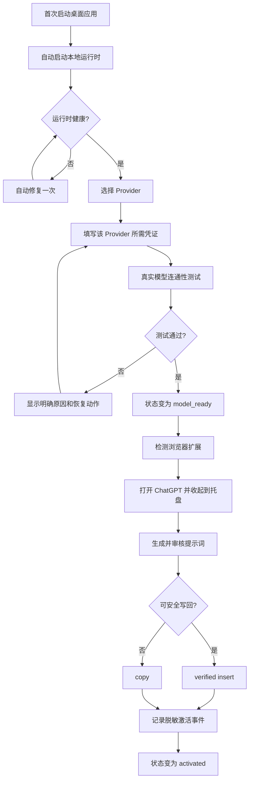

# Smart Prompt 阶段 3：桌面激活闭环与最小控制中心设计

状态：已完成逐项问答确认，待用户审阅书面规格  
日期：2026-07-17  
上游方案：`docs/smart-prompt-first-principles-product-plan-2026-07-17.md`  
适用范围：桌面首次启动、Provider 配置、本地运行时、浏览器扩展激活事件、托盘生命周期、桌面控制中心

## 1. 决策摘要

本阶段采用“纵向激活闭环”，不把工作拆成纯界面重做或无边界的底层重构。

已确认的产品决策：

1. 下一阶段优先证明首次激活，不以桌面真实写回重新认证为阻塞项。
2. 模型接入采用 BYOK，用户必须已有有效 API Key。
3. 首次向导允许用户选择 Agnes、OpenAI-compatible、Anthropic 或 Gemini，并执行真实模型连通性测试。
4. 连通性测试只代表“模型就绪”，不代表产品已经激活。
5. 首次激活必须在真实 Assistant Card 中完成生成，并成功 verified insert 或 copy。
6. 首次激活默认走浏览器扩展，真实验收目标为已登录的 ChatGPT。
7. 桌面应用和浏览器扩展已安装是内测验收前置条件；本阶段不处理商店分发。
8. 首次流程完成后桌面主窗口收起到托盘，后续启动默认不显示主窗口。
9. 控制中心只保留概览、模型、隐私、诊断四页。
10. 开发结束执行分级阻断式对抗审查；P0/P1 必须修复并复审，最终 `pass` 才能完成目标。

## 2. 第一性原理目标

Smart Prompt 的用户价值不发生在设置页，而发生在用户当前准备提问的输入框旁：

> 用户在不离开当前工作上下文的前提下，把模糊草稿变成自己看得懂、改得动、敢于提交的提示词，并由自己决定是否发送。

因此，本阶段不是“做一个更漂亮的桌面设置页”，而是完成从首次启动到第一次真实价值的最短路径。

## 3. 成功路径



Smart Prompt 永不替用户点击发送。

## 4. 激活与健康状态契约

激活进度只允许以下状态：

| 状态 | 含义 | 允许的主要下一步 |
| --- | --- | --- |
| `not_started` | 没有开始配置 | `configuring` |
| `configuring` | 正在选择 Provider 或填写凭证 | `model_ready` |
| `model_ready` | 真实模型连通性测试通过 | `awaiting_first_loop` |
| `awaiting_first_loop` | 等待浏览器完成首次核心循环 | `activated` |
| `activated` | 已完成真实 insert 或 copy | 保持 `activated` |

运行健康必须独立建模，避免一次网络或服务故障抹掉已经完成的激活：

| 健康状态 | 含义 |
| --- | --- |
| `healthy` | 当前运行正常 |
| `repairing` | 正在执行一次自动修复 |
| `needs_repair` | 自动修复失败，需要用户操作 |

约束：

- 不允许仅凭页面渲染、旧顶层 `pass=true`、模型测试通过或桌面写入尝试直接进入 `activated`。
- `activated` 只接受 ChatGPT 的 verified insert，或明确成功的 copy 事件。
- copy 完成只证明复制动作成功，不得伪装成目标输入框机器写回成功。
- 所有状态迁移必须由本地服务校验，桌面与扩展不能各自维护另一份事实源。
- 已经 `activated` 的用户发生运行故障时，只改变健康状态，不回退激活进度。

## 5. 架构边界

### 5.1 Activation 模块

建议新增：

```text
apps/local-service/src/modules/activation/
  activation-contract.js
  activation-store.js
```

职责：

- 持久化和校验激活状态。
- 记录模型就绪、扩展最近可见和首次循环完成。
- 提供旧用户迁移。
- 输出隐私安全的诊断摘要。

建议最小接口：

| 方法与路径 | 用途 |
| --- | --- |
| `GET /activation/status` | 返回统一激活进度、运行健康和下一步动作 |
| `POST /activation/browser-seen` | 扩展启动或 Card 打开时发送脱敏心跳 |
| `POST /activation/complete` | 接受 verified insert 或成功 copy |
| `POST /activation/reset` | 重置向导状态，不删除凭证和其他用户数据 |

`/llm/test` 成功后由服务端在同一受信路径内推进到 `model_ready`，客户端不能自行宣称模型已连通。Prompt Session、Assistant Card 和既有写回接口继续复用，不复制生成或写回逻辑。

### 5.2 桌面启动协调

Tauri 启动顺序：

1. 启动或连接本地服务。
2. 本地服务失败时自动修复一次。
3. 读取 `/activation/status`。
4. 未激活时显示首次向导。
5. 已激活时保持主窗口隐藏。
6. 只有托盘、设置入口或明确错误恢复动作可以打开控制中心。

现有主窗口 `visible: false` 可以保留，但必须补齐“首次启动自动显示向导”的条件分支和持久化判断，不能继续所有状态一律隐藏。

### 5.3 控制中心

建议新增：

```text
apps/desktop-shell/src/control-center/
  app.js
  router.js
  runtime-health.js
  pages/overview.js
  pages/model.js
  pages/privacy.js
  pages/diagnostics.js
```

页面边界：

| 页面 | 回答的问题 | 主要动作 |
| --- | --- | --- |
| 概览 | Smart Prompt 现在是否可用，下一步是什么 | 继续首次使用、重新检测、打开 ChatGPT |
| 模型 | 当前 Provider 和模型是否可用 | 选择 Provider、保存凭证、测试连通性 |
| 隐私 | 产品读取和保存什么 | 查看边界、执行可恢复的数据重置 |
| 诊断 | 出问题后如何恢复 | 自动修复、查看兼容性、导出脱敏诊断 |

本阶段从普通界面移除：

- 营销 Hero 和大段品牌介绍。
- 主窗口 Draft/Prompt 工作台。
- Service 启动、停止和重启按钮。
- Desktop Self-Test。
- Learning、Pilot、Quality、Segments 和 Outcome Follow-up。
- Skill/Prompt 资料管理、历史、收藏和反馈。

这些底层能力可以暂时保留，避免扩大删除风险，但不得继续成为普通用户导航或首屏内容。

### 5.4 浏览器扩展激活事件

扩展在以下时机发送状态：

- 扩展启动或 Assistant Card 打开：`browser-seen`。
- ChatGPT verified insert 成功：`complete`，`completionKind=verified_insert`。
- copy 成功：`complete`，`completionKind=copy`。

`browser-seen` 和 `complete` 必须沿用现有本地服务认证边界并通过严格 schema 校验，不能接受任意网页直接宣称激活完成。

事件只允许保存：

- 固定站点标识 `chatgpt`。
- 完成方式。
- 是否机器验证。
- Provider 标识。
- 时间戳、版本和有限 reason token。

不得保存 Prompt 正文、草稿正文、目标输入正文、剪贴板正文、API Key、raw title 或 raw DOM 文本。

## 6. Provider 与连通性测试

首次向导允许选择：

- Agnes
- OpenAI-compatible
- Anthropic
- Gemini

交互约束：

- 选择 Provider 后只显示该 Provider 所需字段。
- Base URL、模型等使用已有推荐默认值；非必要字段放入高级设置。
- 不允许同时展示所有 Provider 的 Key 输入框。
- 凭证继续使用现有本地加密存储，不引入云端账号。
- 连通性测试必须发起真实模型请求，不能只检查字段是否非空。
- 只有服务端完成真实测试后才能推进激活进度，不能接受客户端自报 `model_ready`。
- 测试输入使用固定、无用户数据的最小内容。
- 测试响应正文不进入激活记录或诊断导出。

错误必须归一为有限类别：

| 类别 | 用户表达 | 恢复动作 |
| --- | --- | --- |
| `credential_invalid` | 凭证无效或权限不足 | 返回当前 Provider 凭证字段 |
| `model_unavailable` | 模型不可用 | 打开模型高级设置 |
| `network_unavailable` | 无法连接 Provider | 重试并检查网络或 Base URL |
| `provider_error` | Provider 暂时不可用 | 稍后重试或切换 Provider |

## 7. 旧用户迁移

当新的 Activation 状态不存在时：

1. 已有有效 Provider，且存在历史浏览器 verified insert/copy：迁移为 `activated`。
2. 已有有效 Provider，但没有真实核心循环证据：进入 `awaiting_first_loop`。
3. 没有有效 Provider：进入 `configuring`。

迁移不能依赖：

- 旧桌面写入顶层 `pass`。
- 仅 `write.attempted=true`。
- 离线截图或视觉 smoke。
- 仅 Provider 字段存在但连通性未知。

## 8. 错误恢复

- 本地服务失败：自动重启一次；仍失败时打开最小修复界面。
- Provider 失败：保留已填写内容，聚焦到可修复字段。
- 扩展未连接：显示“未检测到扩展”和重新检测，不伪装成功。
- ChatGPT Adapter 失败：保留生成结果并提供复制，同时记录 Adapter 回归。
- 写回失败：保持 `no-auto-submit`，不得放宽 DOM 目标验证。
- 激活事件提交失败：本地排队有限次重试，不能重复创建互相矛盾的完成记录。
- 已激活用户的瞬时故障只改变运行健康，不得重新打开首次向导。

## 9. 视觉与交互约束

- 延续现有 Smart Prompt 品牌和组件语言，不在本阶段重新发明视觉体系。
- 控制中心是安静、紧凑、任务导向的工具界面，不做营销落地页。
- 首次向导每一步只有一个主操作，并明确展示当前进度和恢复动作。
- 不使用嵌套卡片、超大 Hero、研发术语或面向开发者的原始状态 token。
- 所有窗口尺寸下不得出现文字溢出、控件重叠和关键操作被遮挡。
- Provider、页面导航、显隐设置使用合适的选择控件、标签页、开关和图标按钮。
- 保持键盘可达、可见焦点、合理标签和错误关联。

## 10. 验收策略

### 10.1 契约与单元测试

必须覆盖：

- 五个激活进度、三个运行健康状态及全部合法迁移。
- 非法迁移不能直接进入 `activated`。
- verified insert 与 copy 的不同证据语义。
- 四个 Provider 的字段隔离和连通性错误映射。
- 三条旧用户迁移路径。
- 激活状态重置不删除凭证。
- 激活事件、诊断和日志的隐私扫描。

### 10.2 桌面运行验收

- 全新状态首次启动只显示向导。
- `activated` 状态二次启动不显示主窗口。
- 关闭主窗口默认收起托盘。
- 服务故障自动修复一次。
- 控制中心只有四页且没有被移除的普通用户内容。
- 旧设置和现有加密凭证保持兼容。

### 10.3 浏览器自动化验收

本地 Demo 必须验证：

```text
草稿 -> 生成 -> 审核/编辑 -> verified insert 或 copy
-> activation complete -> no-auto-submit
```

自动化测试必须覆盖激活事件失败、重复事件幂等和目标丢失降级。

### 10.4 ChatGPT 真实 GUI 验收

前置条件：

- 桌面应用与扩展已安装。
- 用户已登录 `chatgpt.com`。
- 用户持有有效 Provider Key。
- 用户明确授权本轮真实 GUI 测试。

验收动作：

1. 从全新激活状态启动。
2. 选择 Provider 并通过真实连通性测试。
3. 打开 ChatGPT 并让桌面主窗口收起到托盘。
4. 在真实输入框完成生成和审核。
5. 执行填入并做 DOM 回读；若安全写回不可用则执行 copy。
6. 确认没有自动发送。
7. 确认激活状态变为 `activated`。
8. 重启桌面应用，确认主窗口保持隐藏。

真实测试只使用预先定义的非敏感合成草稿。证据只保存脱敏状态、时间、版本、经过遮挡或裁切的截图和有限 reason，不保存可还原的输入正文。

### 10.5 可恢复的数据重置

隐私页不得直接调用现有永久删除路径。数据重置必须先把当前数据移动到带时间戳的可恢复归档，或使用经过验证的 Windows 回收站机制，再重新初始化默认数据。界面必须诚实说明恢复位置和保留范围。

### 10.6 时间指标

本阶段只承诺：

> 在桌面与扩展已安装、ChatGPT 已登录、用户拥有有效 Key 的条件下，一次全新真实激活流程不超过 3 分钟。

计时从首次向导可交互开始，到本地服务确认 `activated` 结束。单次验证不得表述为“中位数”；中位数指标必须等待真实内测样本。

## 11. 对抗审查

常规开发和验证全部完成后，必须由独立找茬角色审查以下七个方向：

1. 完全不理解 Provider 的新用户。
2. 本地服务、网络和 Provider 故障。
3. 错误 Key、错误模型和 Provider 切换。
4. ChatGPT DOM 变化、错误目标和写回失败。
5. 隐私、凭证泄露和 `no-auto-submit`。
6. 旧用户迁移、托盘和重复启动。
7. 键盘、焦点、窗口尺寸、范围膨胀和无关重构。

每个发现必须包含：

- 严重级别。
- 文件与行号。
- 复现步骤。
- 证据。
- 用户影响。
- 修复建议。

分级规则：

| 等级 | 例子 | 处理 |
| --- | --- | --- |
| P0 | 自动发送、误写、Key/正文泄露、安全守卫绕过 | 立即阻断并修复 |
| P1 | 首次激活失败、错误成功状态、迁移丢失、真实 ChatGPT 闭环失败 | 阻断并修复 |
| P2 | 次要视觉、非核心兼容性和可延后优化 | 记录风险，不阻断 |

最多执行三轮“审查 -> 修复 -> 全量复审”。三轮后仍存在 P0/P1 时，目标必须标记 blocked，禁止伪报完成。最终审查必须输出明确 `pass` verdict。

建议产物：

```text
docs/reviews/phase3-activation-adversarial-review.md
research/phase3-activation-acceptance.latest.json
```

## 12. 明确非目标

- 浏览器扩展商店发布、自动安装和开发者模式安装向导。
- Codex、Trae、WorkBuddy 桌面写回重新认证。
- WorkBuddy UIA 或剪贴板 fallback 攻坚。
- Skill 资料页、Prompt 库、历史、收藏和反馈。
- 新 Provider、新站点、新模式和新 Overlay 控件。
- 云端账号、试用额度、计费、远程遥测和团队同步。
- 大型前端框架迁移或与激活闭环无关的全仓重构。

## 13. 完成定义

只有同时满足以下条件才可完成阶段 3：

1. 设计范围内代码和迁移完成。
2. 契约、桌面、浏览器和隐私测试通过。
3. 获得用户授权后，ChatGPT 真实 GUI 闭环通过。
4. 真实流程确认 `no-auto-submit`。
5. 全新与旧用户启动行为均通过。
6. 时间证据满足本阶段单次内测口径。
7. 对抗审查最终 verdict 为 `pass`。
8. 命令验证、GUI 验证和真实闭环验证分别报告，不能相互替代。
